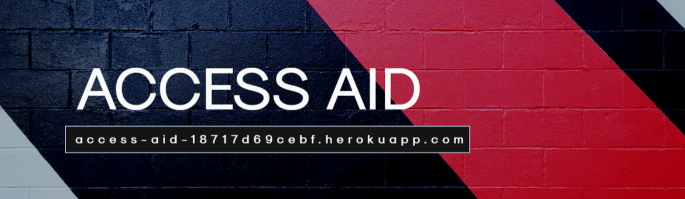
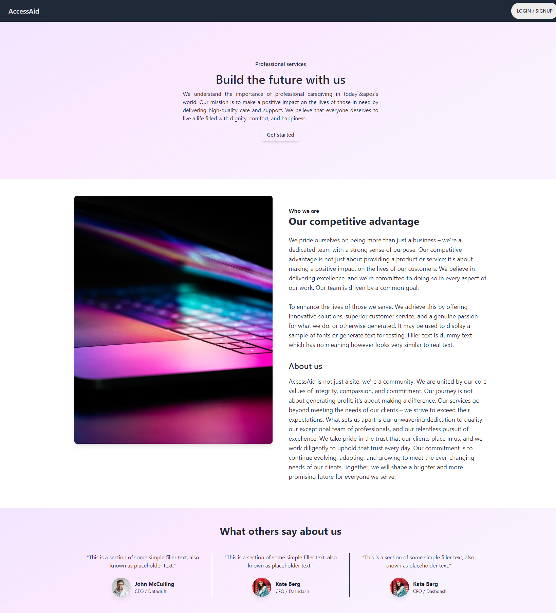
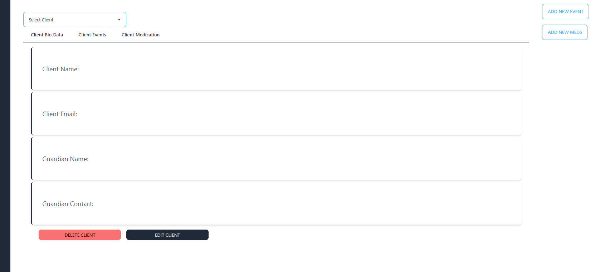
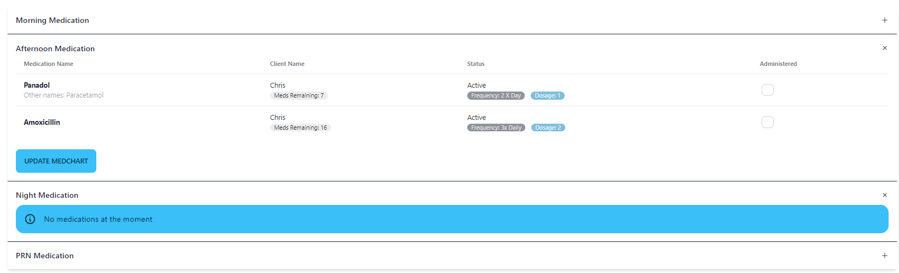

# AccessAid

## Table of Contents

- [Description](#description)
- [Live-URL](#live-url)
- [Screenshots](#screenshots)
- [Technologies-Used](#technologies-used)
- [Installation](#installation)
- [Credits](#credits)
- [Features](#features)
- [Usage-Information](#usage-information)
- [Suggested-Future-Development](#suggested-future-development)
- [Contribution-Guidelines](#contribution-guidelines)
- [Test-Instructions](#test-instructions)
- [License](#license)
- [Questions](#questions)

## Description

Access Aid is a client-centric organization dedicated to enhancing the quality of care for individuals in need of support. We provide a comprehensive platform designed to improve the tracking and management of client affairs, with a primary focus on events, appointments, and medication management. Our mission is to empower individuals to lead healthier and more fulfilling lives while fostering community growth, hope, and positive change.

Access Aid, we're transforming the way we care for clients in today's fast-paced world. We provide a cutting-edge platform for comprehensive tracking and management of client affairs, from vital appointments to medication schedules. Our mission is simple: to enhance the quality of life for our clients through authentic, modern, and efficient support. With Access Aid, you can rest assured that you're not alone in your journey. We're here to empower you and your caregivers, ensuring that you receive the best care and support you deserve. Join us in the pursuit of better, more personalized care for modern life.

## Live-URL

[Link to live URL](https://access-aid-18717d69cebf.herokuapp.com/)

## Screenshots

## Technologies-Used

This application was created using the MERN stack along with:

- Bcrypt
- JSON Web Tokens
- Apollo GraphQL
- GraphQL
- Mongoose
- NodeMon
- Tailwind CSS
- dayjs
- ESLint

## Installation

1. Using Git Bash or Terminal, clone the repository using command: `git clone https://github.com/MwangiR/AccessAid.git`
2. Change Directory to the repo folder and run command `code .` to launch the repo in VS Code
3. Ensure that you have Node.js installed, and run the command `NPM Install` in the root directory for the repo to install all required dependencies
4. Ensure that you have MongoDB and MongoDB compass installed
5. run command `NPM Run Develop` run database and client side

## Credits

Renny Mwangi: [Link to Github](https://github.com/MwangiR/)

## Features

- **Client-Centered Services:** We put our clients first, offering personalized care and support to meet their unique needs.

- **Efficient Medication Management:** We provide a stress-free approach to medication management that promotes well-being without the clinical feel of a hospital.

- **Community Impact:** By strengthening the bonds within the community, we aim to enrich the lives of our clients and those around them.

- **Real-World Results:** Access Aid has a proven track record of making a positive difference in the lives of our clients through stability, growth, hope, and change.

## Usage-Information

## Getting Started

1. Sign up for Access Aid services through our website.
2. Explore the various features and options tailored to your specific needs.
3. Experience the benefits of streamlined client affairs tracking, appointments, and medication management.

## Suggested-Future-Development

### **Incident Management System**

The _Incident Management System_ is an upcoming feature within Access Aid that will empower our users to effectively handle and document critical incidents or emergencies. This system will provide a structured and user-friendly approach for users to report and manage incidents, ensuring that timely actions are taken. With a customizable interface, users can tailor the system to their specific needs and preferences, making it a valuable tool for maintaining safety and improving the overall care of our clients.

### **Chat System**

Our _Chat System_ is a forthcoming feature designed to facilitate seamless communication and collaboration among users within the Access Aid platform. This real-time chat functionality will offer a secure and interactive environment for users to engage with one another, share information, and coordinate tasks. Whether it's clients, caregivers, or healthcare professionals, this system will enhance the sense of community and support that Access Aid stands for. Additionally, the Chat System will be adaptable and customizable to suit the unique requirements of our users, allowing for personalized and effective communication.

### **Tailor-Made Evolution**

At Access Aid, we believe in tailoring our services to meet the unique and evolving needs of our users. Our upcoming developments, including the Incident Management System and the Chat System, are no exception. These features can be customized and evolved to align with the specific requirements and preferences of our clients and users. This adaptability ensures that Access Aid remains a flexible and client-centric platform, providing solutions that can be tailored to your organization's and clients' specific needs.

## Contribution-Guidelines

Open to collaboration, if you choose to do so open an issue and modify any changes you would like to see on a feature branch and wait for approval before merging to the main branch.

## Test-Instructions

Work In Progress

## License

NOTICE: This application is covered under the MIT License

## Questions

Have additional questions? Click the links below to us reach us through GitHub or Email.

Renny Mwangi: [Link to Github](https://github.com/MwangiR/)
